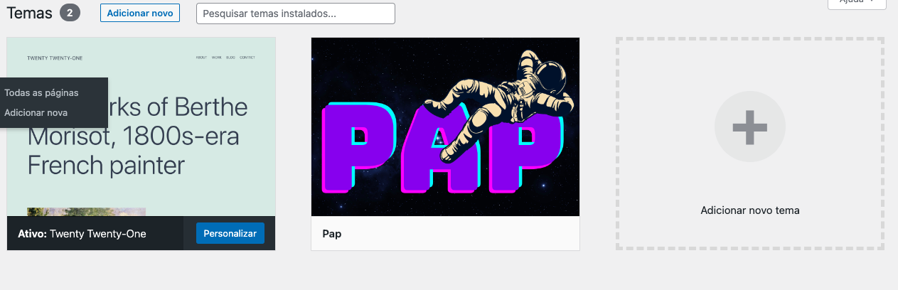
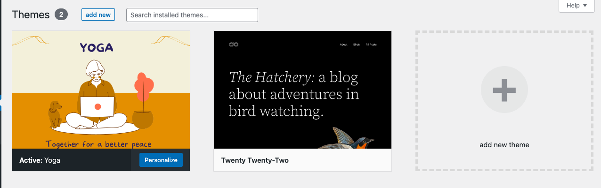

# wordpress theme

These are one of the themes that I like to make for wordpress simply as a hobby, feel free if you want to contribute or download any of the themes for your site.

You can run wordpress using software like XAMPP, which is a local server solution that includes Apache, MySQL and PHP, allowing you to run WordPress on your own machine. Docker is another option, which allows you to build and run application containers in different development environments


## Demonstration of applications on the front-end

<div style="max-width: 100%; overflow: hidden;">
     
</div>

Yoga theme

<div style="max-width: 100%; overflow: hidden;">
     
</div>

### Image of the theme
PAP theme
<div style="max-width: 100%; overflow: hidden;">
    
</div>
Yoga theme
<div style="max-width: 100%; overflow: hidden;">
    
</div>


## How to use


1. Make sure you have Docker installed on your machine.
2. Clone this repository to your computer.
3. Open a terminal and navigate to the theme directory.
4. Run the following command to build the Docker image:

```bash
docker build -t your-image-name .

```
5. When the image is built, run the following command to create a container with the image:
```bash


docker run -d -p 8080:80 your-image-name

```

6. Open a browser and go to http://localhost:8080 to view the WordPress theme.
7. To edit the theme, open the "wp-content/themes" directory and add or edit theme files.

## Personalization

This theme is a foundation for a custom WordPress theme. To customize this theme, follow these steps:

1. Open the "wp-content/themes" directory and copy the theme directory to a new directory with your theme name.
2. Edit the files in the new directory to customize the theme.
3. Open the Dockerfile and change the line that copies the theme directory to match the name of your new directory.
4. Build a new Docker image using the docker build command.
5. Create a new container with the new Docker image using the docker run command.


## TechStack

**Technologies:** JavaScript, PHP, CSS, HTML

**Server:** XAMPP, PHP, Docker

**Database:** MySQL


## Contribution

If you would like to contribute to this theme, feel free to submit a pull request.


## License

[MIT](https://choosealicense.com/licenses/mit/)

### My contact networks    

</h1>
   <a href="https://www.instagram.com/devbrunoo/" target="_blank"></a>
    <a href="https://medium.com/@devbrunoo" target="_blank"></a> 
    <a href="https://www.quora.com/profile/DevBrunoo" target="_blank"></a>
   <a href="https://codepen.io/brunobyhow15" target="_blank"></a> 
    <a href = "mailto:contactbruno5@gmail.com"></a>
    <a href="https://www.linkedin.com/in/devbruono/" target="_blank"></a> 
  
